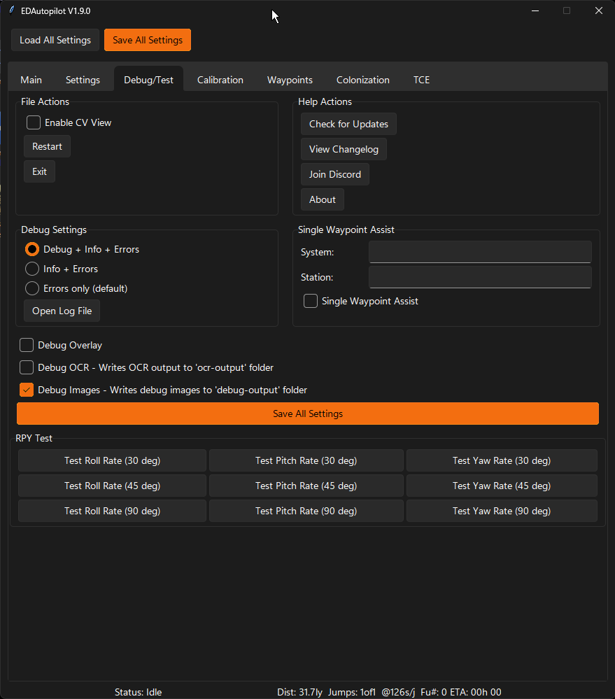

# Debug/Test

## Debug/Test Tab

## File Actions
* Enable CV View - Turn on/off debug images showing the image matching as it happens.  The numbers displayed indicate the % matched with the criteria for matching. Example:  0.55 > 0.5  means 55% match and the criteria is that it has to be > 50%, so in this case the match is true.
* Restart - Restarts the application.
* Exit - Quits the application.

## Help Actions
* Check for Updates
* View Changelog
* Join Discord
* About

## Debug Settings
* Debug + Info + Errors
* Info + Errors
* Errors only (default)
* Open Log File - Opens the log file. Useful when troubleshooting when EDAP misbehaves. Can also be submitted to discord for analysis.

## Single Waypoint Assist
* System
* Station
* Single Waypoint Assist

## Other Settings
* Debug Overlay - Enables debug data to be displayed over the Elite Dangerous screen while playing the game.
* Debug OCR - Enables OCR debug output to be stored in the 'ocr_output' folder.
* Debug Images - Enables debug images to be stored in the 'debug_output' folder.

## RPY Test
Ignore these, they are just for dev testing.