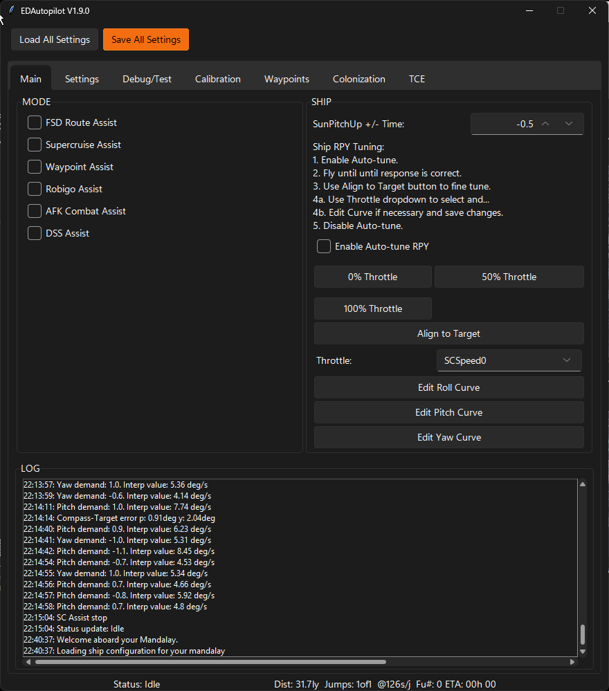

# Main

## Main Tab

## Mode

### FSD Route Assist
For the FSD Route Assist, you select your destination in the GalaxyMap and then enable this assistant and it will perform all the jumps to get you to your destination, AFK.  Furthermore while
executing route assistance it will perform detailed system scanning (honk) when jumping into a system and optionally perform FSS scanning
to determine if Earth, Water, or Ammonia type world is present.
### Supercruise Assist
The supercruise (SC) assistant (and not using ED's SC Assist which takes up a slot, for a piece of software?) 
will keep you on target and when "TO DISENGAGE" is presented and will autodrop out of SC and perform autodocking with the targeted Station.  
### Waypoint Assist
With Waypoint Assist you define the route in a file and this assist will jump to those waypoints.  If a Station is defined to dock at, the assistant will transition to SC Assist and
dock with the station.  A early version of a trading capability is also included. 
Additional information on Waypoints can be found [here](docs/Waypoint.md).
Additional information on the Waypoint Editor tab can be found [here](docs/WaypointEditor.md).
### Robigo Mines Assist
The Robigo Assist performs the Robigo Mines passenger mission loop which includes mission selection, mission completetion, and the full loop to Sirius Atmospherics. 
Additional information can be found [here](docs/Robigo.md). 
### AFK Combat Assist
* AFK Combat Assist: used with a AFK Combat ship in a Rez Zone.  It will detect if shields have
    dropped and if so, will boost away and go into supercruise for ~10sec... then drop, put pips to
    system and weapons and deploy fighter, then terminate.  While in the Rez Zone, if your fighter has
    been destroyed it will deploy another fighter (assumes you have two bays)
### DSS Assist
TBD

## Ship

* SunPitchUp+Time - field are for ship that tend to overheat. Providing 1-2 more seconds of Pitch up when avoiding the Sun
    will overcome this problem.  This will be Ship unique and this value will be saved along with the Roll, Pitch, Yaw values 
* Tuning - TBD

## Log
A read only log.