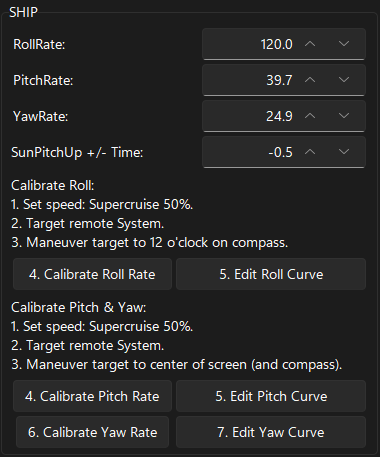

# Roll, Pitch, Yaw (RPY)
The values for Pitch and Roll are critical for proper Autopilot behavior. Yaw is also used, but to a lesser degree.
Each ship type will have different RPY values that need to be tuned using the instructions below. Once the RPY
values have been determined for a ship type, EDAP will store the values and will automatically load the correct values
when the active ship is changed. A ship config can also be manually loaded using the load button.

Take the RPY values from Outfitting, pay attention to the order, it is Pitch, Roll, Yaw in Outfitting.  Also pay
attention to the order on the GUI as it is Roll, Pitch, Yaw.

The RPY values from Outfitting are the rates the ship can achieve while in normal space, while in supercruise
the rates are much lower.  Since Autopilot utilizes these rates in Supercruise, they must be adjusted.  See tests
done by one CMDR: https://forums.frontier.co.uk/threads/supercruise-handling-of-ships.396845/.  
Also see: https://lavewiki.com/ship-control

## Ship Tuning
This is the ship tuning section. It is broken down into the following sections:
*  Rates and Pitch Up time
* Tuning of ship Roll
* Tuning of ship Pitch and Yaw

Six RPY curves are used by EDAP:
*  0%, 50% and 100% throttle in normal space (not SC)
*  0%, 50% and 100% throttle in Supercruise

Some are rarely used. These are the most used in order of use: 50% SC, 0% SC and 0% space (non-SC). So these are the ones that are most important to have well tuned. 

Three buttons allow the speed to be set. These are used because EDAP has no way to determine the actual throttle or speed. The same buttons can be used in SC and normal space, so the SC/non-SC selection is performed by the user entering or exiting SC.

The process is as follows:

### Tuning Ship Roll

1. Determine which throttle to tune at (0/50/100%) and SC/non-SC.
2. Enter/exit SC as appropriate.
3. Set the correct speed using the throttle buttons.
4. Target a remote system.
5. Maneuver so that the navigation dot is at the top dead center of the compass (at the 12 o'clock position on the outer circle).
6. Press the Gather Roll Rates button.
7. The ship will start making very small roll adjustments in one or both directions as it measure how far it moves within a defined time.
8. The movements will slowly increase until the ship is moving enough. The roll rates are recorded during the process.
9. After all required roll angles have been checked, the tuning will complete.
10. You have the opportunity of checking the curve of the current speed and editing the points. The curve should be smooth, so smooth out any points that do not fit the curve.
11. Save your settings.

### Tuning Ship Pitch and Yaw

1. Determine which throttle to tune at (0/50/100%) and SC/non-SC.
2. Enter/exit SC as appropriate.
3. Set the correct speed using the throttle buttons.
4. Target a remote system.
5. Maneuver so that the navigation dot is at the very center of the compass. The Target should be at the center of the screen.
6. Press the Gather Pitch or Yaw Rates button.
7. The ship will start making very small pitch/yaw adjustments in one or both directions as it measure how far it moves within a defined time.
8. The movements will slowly increase until the ship is moving enough. The pitch/yaw rates are recorded during the process.
9. After all required pitch/yaw angles have been checked, the tuning will complete.
10. You have the opportunity of checking the curve of the current speed and editing the points. The curve should be smooth, so smooth out any points that do not fit the curve.
11. Save your settings.

Note: You can also edit the curves without running the test by pressing the edit curve button at any time. Just remember to enter/exit SC and press the set speed buttons to load the correct curve.