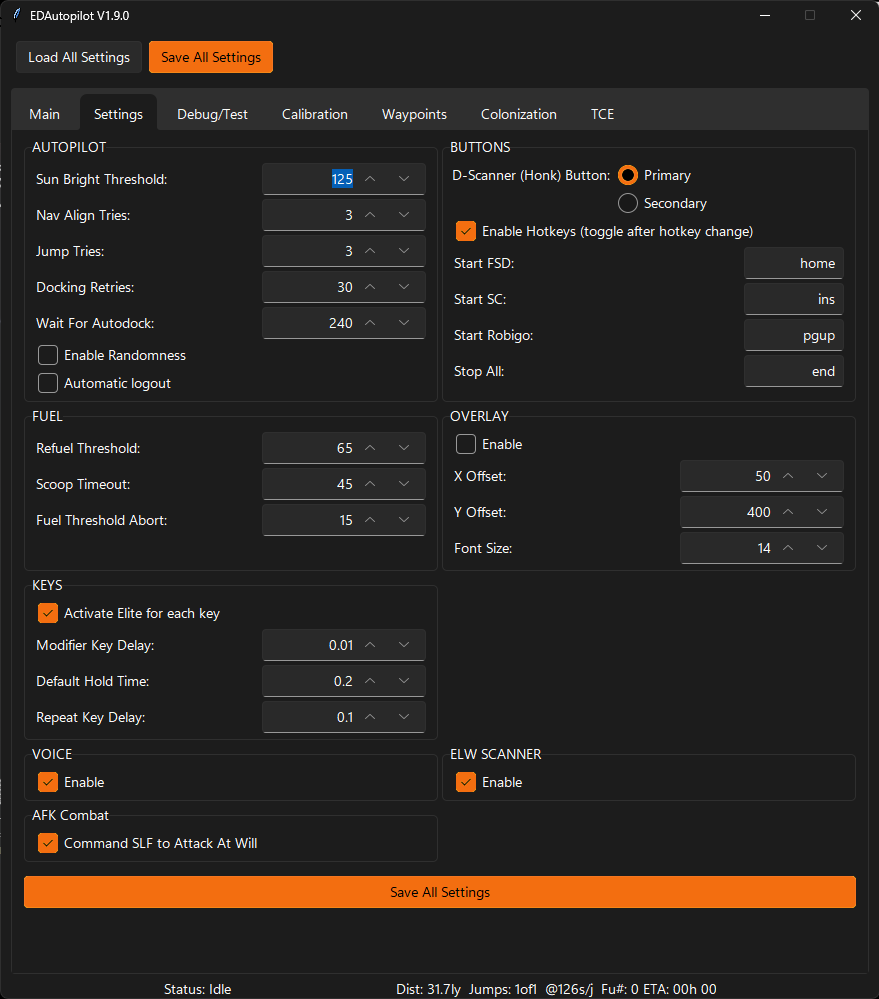

# Settings

## Settings Tab

## Autopilot
* Sun Bright Threshold : The low level for brightness detection, range 0-255, want to mask out darker items
* Nav Align Tries : How many attempts the ap should make at alignment.
* Jump Tries : How many attempts the ap should make to jump.
* Docking Retries : How many attempts to make to dock.
* Wait For Autodock : After docking granted, wait this amount of time for us to get docked with autodocking
* Enable Randomness
* Automatic logout

## Buttons
* Home - Start FSD Assist
* Ins  - Start SC Assist
* Pg Up - Start Robigo Assist
* End  - Terminate any running assistants

Hot keys are now configurable in the config-AP.json file, so you can remap them. Be sure not to use any keys you have mapped in ED.
The hotkey must be in the format 'ctrl+shift+a, s'. This would trigger when the user holds ctrl, shift and "a" at once, releases, and then presses "s". To represent literal commas, pluses, and spaces, use their names ('comma', 'plus', 'space').
For those wanting a detailed list, refer to the [Keyboard](https://github.com/boppreh/keyboard/tree/master) module's [winkeyboard.py](https://github.com/boppreh/keyboard/blob/master/keyboard/_winkeyboard.py) file.

## Fuel
* Refuel Threshold : If fuel level get below this level, it will attempt refuel.
* Scoop Timeout : Number of second to wait for full tank, might mean we are not scooping well or got a small scooper.
* Fuel Threshold Abort : Level at which AP will terminate, because we are not scooping well.

## Overlay
* X Offset : Offset left the screen to start place overlay text.
* Y Offset : Offset down the screen to start place overlay text.
* Font Size : Font size of the overlay.

## Keys
* Modifier Key Delay : Delay for key modifiers to ensure modifier is detected before/after the key.
* Default Hold Time : Default hold time for a key press.
* Repeat Key Delay : Delay between key press repeats.

## Voice
* Enable Voice - Turns on/off voice

## ELW Scanner
* ELW Scanner: will perform FSS scans while FSD Assist is traveling between stars.  If the FSS
    shows a signal in the region of Earth, Water or Ammonia type worlds, it will announce that discovery
    and log it into elw.txt file.  Note: it does not do the FSS scan, you would need to terminate FSD Assist
    and manually perform the detailed FSS scan to get credit.  Or come back later to the elw.txt file
    and go to those systems to perform additional detailed scanning. The elw.txt file looks like: 
      _Oochoss BL-M d8-3  %(dot,sig):   0.39,   0.79 Ammonia date: 2022-01-22 11:17:51.338134 
       Slegi BG-E c28-2  %(dot,sig):   0.36,   0.75 Water date: 2022-01-22 11:55:30.714843 
       Slegi TM-L c24-4  %(dot,sig):   0.31,   0.85 Earth date: 2022-01-22 12:04:47.527793 _

## AFK Combat
* Command SLF to Attack at Will
