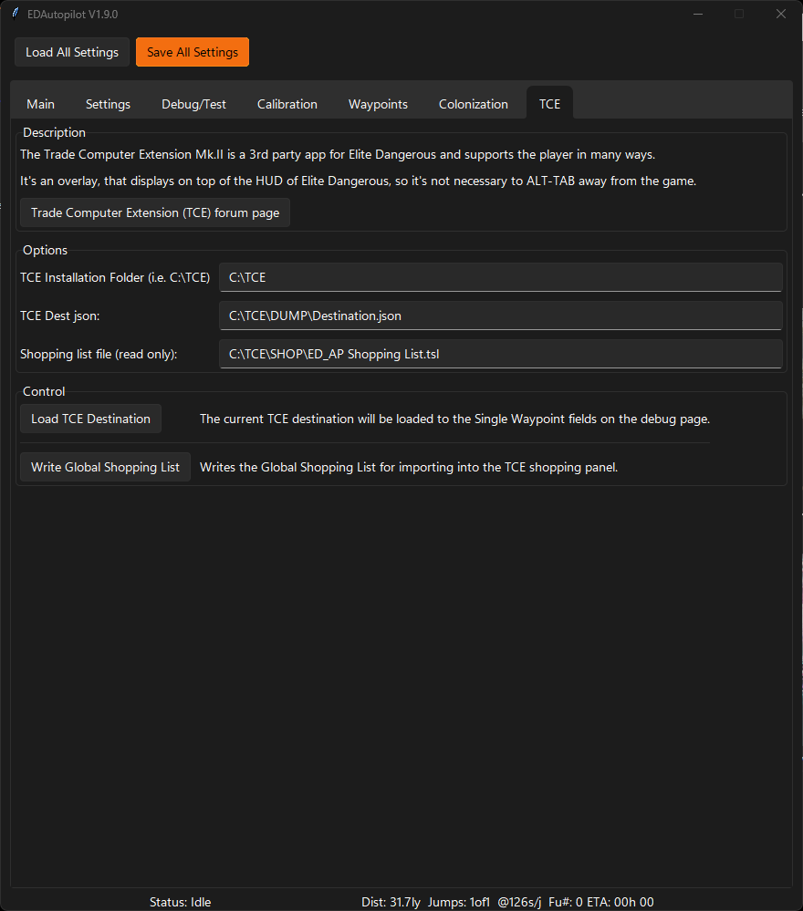

# TCE (Trade Computer Extension) Integration
Basic integration with TCE. The current TCE destination may be loaded as a Single Waypoint Assist target with the Load TCE Destination button on the Debug tab. 
Refer to [TCE on Frontiers Forums](https://forums.frontier.co.uk/threads/trade-computer-extension-mk-ii.223056/) for info on TCE.

## TCE Tab

## Options

* TCE Installation Folder (i.e. C:\TCE) - The install folder of TCE.
* TCE Dest json - The destination file generated by TCE.
* Shopping list file (read only) - The path of the shopping list file. Used to read the item IDs from TCE allowing generation of the shopping list files. 

## Control

* Load TCE Destination - The current TCE destination will be loaded to the Single Waypoint fields on the debug page.
* Write Global Shopping List - Writes the Global Shopping List for importing into the TCE shopping panel.